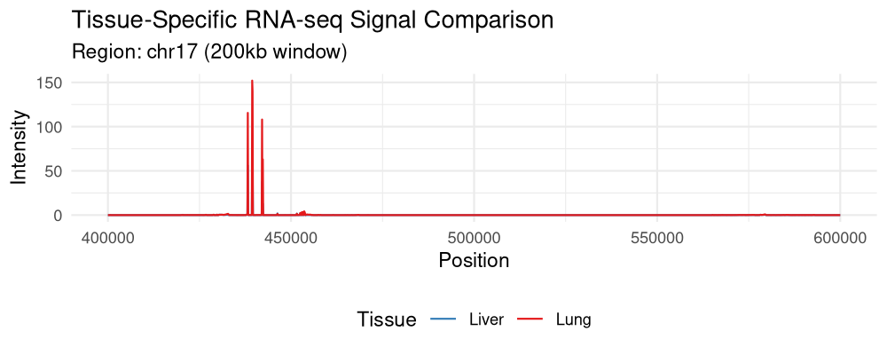
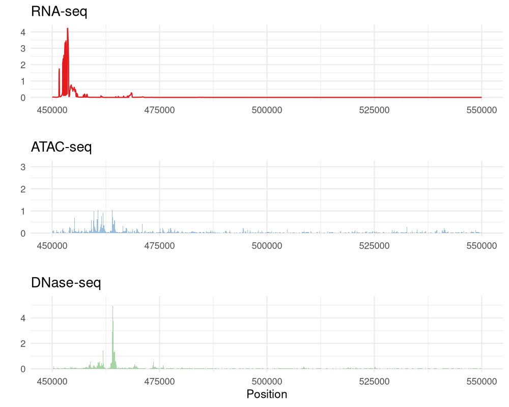

# <p align="center"></p>

<p align="center">
  <b>Bridging Deep Learning and Functional Genomics for the Bioconductor Ecosystem</b>
</p>

<p align="center">
  <a href="https://github.com/Bioconductor/Contributions/issues/4256">
    
  </a>
  <a href="https://mintlify.wiki/BDB-Genomics/AlphaGenomeR">
    
  </a>
  <a href="https://deepwiki.com/BDB-Genomics/AlphaGenomeR">
    
  </a>
  <a href="https://opensource.org/licenses/Apache-2.0">
    
  </a>
</p>

---

## 🧬 Scientific Overview

**AlphaGenomeR** provides a unified R interface to **AlphaGenome**, Google DeepMind's state-of-the-art transformer model for functional genomics. AlphaGenome predicts a comprehensive suite of regulatory features directly from DNA sequences at **single-base resolution**.

Traditional genomic analysis requires vast amounts of experimental data (RNA-seq, ATAC-seq, ChIP-seq). AlphaGenomeR allows researchers to generate **in silico** predictions for any 1MB genomic window, enabling rapid hypothesis testing and regulatory element discovery without the immediate need for expensive wet-lab assays.

---

## 🚀 Key Capabilities

*   🛡️ **Multi-Modal Integration**: Query 11+ biological modalities (Expression, Chromatin, Splicing, 3D Architecture) in a single API call.
*   🧠 **Tissue-Specific Logic**: Leverage UBERON and CL ontologies to predict how the same sequence functions in different biological contexts.
*   ⚡ **High-Performance gRPC**: Built on a robust `reticulate` bridge to DeepMind's gRPC backend for efficient data streaming.
*   📊 **Bioinformatics Native**: Returns standard R `matrix` and `data.frame` objects, compatible with `GenomicRanges`, `DESeq2`, and `Gviz`.

---

## 🎨 Results Gallery

### 💎 Tissue Specificity at Scale
AlphaGenome captures the subtle differences in the regulatory code across tissues. The plot below illustrates the predicted RNA-seq signal for the same 200kb region in Lung vs. Liver.

<p align="center">
  
</p>

### 🧬 Synchronized Multimodal Signal
View synchronized tracks of chromatin accessibility (ATAC/DNase) and gene expression (RNA-seq) to identify active enhancers and promoters with base-pair precision.

<p align="center">
  
</p>

---

## 🛠️ Installation

### 1. System Requirements
AlphaGenomeR requires Python 3.10+ and the official SDK:
```bash
pip install alphagenome
```

### 2. R Package
```r
if (!require("devtools")) install.packages("devtools")
devtools::install_github("BDB-Genomics/AlphaGenomeR")
```

---

## 📖 Quick Start

```r
library(AlphaGenomeR)

# 1. Query a 1MB genomic region for Lung tissue
results <- alphagenome_query(
  access_token = "YOUR_API_KEY",
  genomic_region = "chr17:42560601-43609177",
  ontology_terms = "UBERON:0002048",
  requested_outputs = c("RNA_SEQ", "ATAC", "DNASE")
)

# 2. Extract specific signal tracks
rna_data <- alphagenome_get_rna_seq(results)
atac_data <- alphagenome_get_atac(results)

# 3. Analyze native R data structures
print(dim(rna_data$values))
```

---

## 📑 Supported Extractors

| Modality | Function | Description |
| :--- | :--- | :--- |
| **RNA-seq** | `alphagenome_get_rna_seq()` | Predicted Gene Expression levels |
| **ATAC-seq** | `alphagenome_get_atac()` | Chromatin Accessibility signal |
| **DNase-seq** | `alphagenome_get_dnase()` | Hypersensitivity peaks |
| **CAGE** | `alphagenome_get_cage()` | Transcription Start Site (TSS) signal |
| **ChIP-seq** | `alphagenome_get_chip_tf()` | Transcription Factor Binding sites |
| **Histone** | `alphagenome_get_chip_histone()` | Histone Modification marks |
| **3D Genome** | `alphagenome_get_contact_maps()` | Chromatin Contact maps |

---

## 📜 Citation & License

If you use AlphaGenomeR in your work, please cite:
> **DeepMind AlphaGenome Team.** "Predicting the regulatory code of DNA sequences with AlphaGenome." *Nature* (2026).

Licensed under **Apache License 2.0**. API usage is for **non-commercial research only**.

<p align="center">
  Developed with ❤️ by <b>AncientHearings</b> & The <b>BDB Genomics</b> Team
</p>
