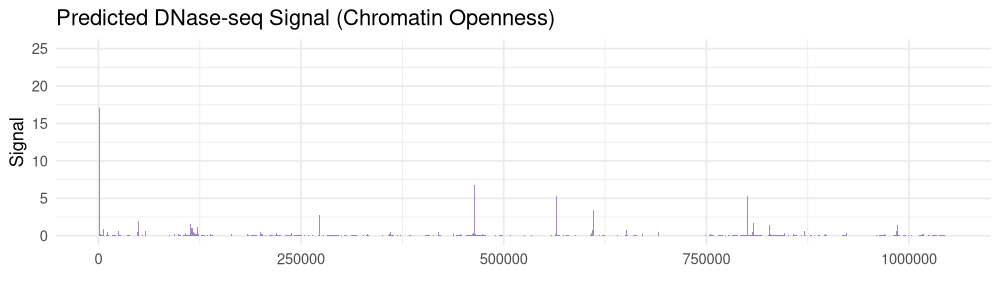
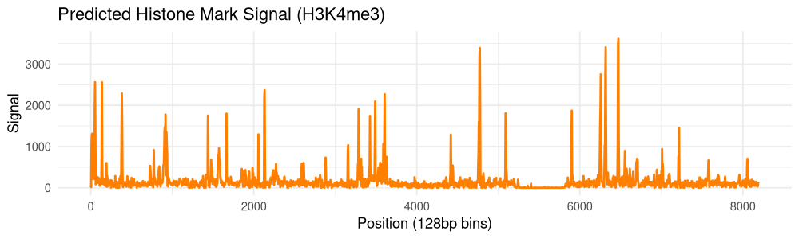

# AlphaGenomeR

**R Interface to Google DeepMind's AlphaGenome API**

[](https://github.com/Bioconductor/Contributions/issues/4256)
[](https://opensource.org/licenses/Apache-2.0)
[](https://mintlify.wiki/BDB-Genomics/AlphaGenomeR)
[](https://deepwiki.com/BDB-Genomics/AlphaGenomeR)
[](https://github.com/BDB-Genomics/AlphaGenomeR/actions)

## Overview

AlphaGenomeR is a Bioconductor package providing a high-performance interface to **AlphaGenome**, a transformer-based model developed by Google DeepMind for functional genomics. The package enables the retrieval of multimodal predictions (RNA-seq, ATAC-seq, CAGE, ChIP-seq, and 3D contact maps) at single-base resolution across 1MB genomic intervals.


*Figure 1: Multimodal signal tracks (RNA-seq, ATAC-seq, and CAGE) predicted for a 1MB region on Chromosome 17 using AlphaGenomeR.*

## Deep Dive: Multimodal Prediction Gallery

AlphaGenome is trained to predict the functional regulatory code of DNA. Below are detailed examples of diverse modalities retrieved using AlphaGenomeR.

### 🧬 Chromatin Accessibility (DNase-seq)
Predict open chromatin regions with high precision. DNase-seq peaks correspond to active regulatory elements like enhancers and promoters.


*Figure 2: Predicted DNase-seq signal showing regions of open chromatin across a 1MB window.*

### 💎 Epigenetic Landscape (Histone Marks)
Identify biochemical modifications to histone proteins (e.g., H3K4me3) which mark active transcription and promoter regions.


*Figure 3: Predicted ChIP-seq signal for H3K4me3, illustrating the model's ability to capture binned epigenetic features (128bp resolution).*

### 🧠 Tissue-Specific Regulatory Intelligence
By leveraging **UBERON** and **CL** ontology terms, AlphaGenomeR allows you to query how the same DNA sequence behaves across different biological contexts.

- **Lung** (`UBERON:0002048`)
- **Liver** (`UBERON:0002107`)
- **K562 Cell Line** (`CL:0002064`)

## Key Features

* **Multimodal Integration**: Simultaneous retrieval of 11+ biological modalities.
* **Base-Pair Resolution**: Detailed signal intensity for sequences up to 1MB.
* **Bioconductor Compatible**: Returns native R `matrix` and `data.frame` objects, ready for downstream analysis with `DESeq2`, `GenomicRanges`, or `Gviz`.
* **High-Throughput gRPC**: Leverages the official Google DeepMind gRPC backend for efficient data streaming.

## Installation

### Prerequisites
AlphaGenomeR requires Python (>= 3.10) and the official `alphagenome` Python package:
```bash
pip install alphagenome
```

### R Package
```r
if (!require("devtools")) install.packages("devtools")
devtools::install_github("BDB-Genomics/AlphaGenomeR")
```

## Quick Start

```r
library(AlphaGenomeR)

# 1. Initialize API Key and Region
api_key <- "YOUR_API_KEY"
region  <- "chr17:42560601-43609177" 

# 2. Query Predictions
results <- alphagenome_query(
  access_token = api_key,
  genomic_region = region,
  ontology_terms = c("UBERON:0002048"), # Lung
  requested_outputs = c("RNA_SEQ", "ATAC", "DNASE")
)

# 3. Extract and Analyze
rna_data <- alphagenome_get_rna_seq(results)
head(rna_data$values)
```

## Supported Modalities

| Category | Function | Modality |
| :--- | :--- | :--- |
| **Expression** | `alphagenome_get_rna_seq()` | RNA-seq Gene Expression |
| | `alphagenome_get_cage()` | CAGE TSS Signal |
| **Chromatin** | `alphagenome_get_atac()` | ATAC-seq Accessibility |
| | `alphagenome_get_dnase()` | DNase-seq Hypersensitivity |
| **Epigenome** | `alphagenome_get_chip_tf()` | ChIP-seq (Transcription Factors) |
| | `alphagenome_get_chip_histone()` | ChIP-seq (Histone Marks) |
| **Splicing** | `alphagenome_get_splice_sites()` | Predicted Splice Sites |
| | `alphagenome_get_splice_junctions()` | Splice Junction Predictions |
| **3D Genome** | `alphagenome_get_contact_maps()` | Chromatin Contact Maps |

## Citation
If you use AlphaGenomeR in your research, please cite:
> DeepMind AlphaGenome Team. "Predicting the regulatory code of DNA sequences with AlphaGenome." *Nature* (2026).

## License
AlphaGenomeR is licensed under the **Apache License 2.0**.
Usage of the AlphaGenome API is restricted to non-commercial research purposes.
