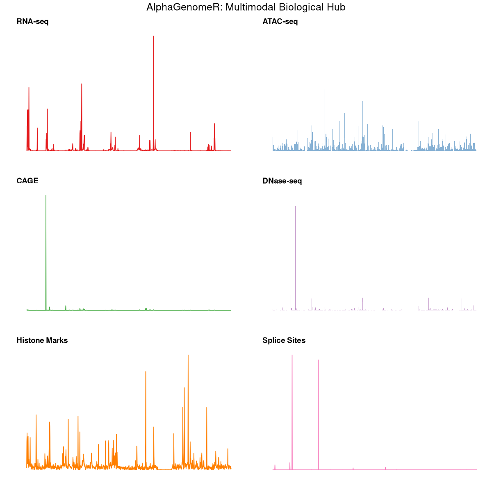

# <p align="center"></p>

<p align="center">
  <b>High-Resolution Functional Genomics Bridge for Bioconductor</b>
</p>

<p align="center">
  <a href="https://github.com/Bioconductor/Contributions/issues/4256">
    
  </a>
  <a href="https://mintlify.wiki/BDB-Genomics/AlphaGenomeR">
    
  </a>
  <a href="https://deepwiki.com/BDB-Genomics/AlphaGenomeR">
    
  </a>
  <a href="https://opensource.org/licenses/Apache-2.0">
    
  </a>
</p>

---

## 🧬 Scientific Overview

**AlphaGenomeR** is a state-of-the-art R interface to the **AlphaGenome** API. It empowers researchers to generate **single-base resolution** functional genomic predictions directly from DNA sequences across 1MB genomic windows. 

By eliminating the immediate barrier of expensive sequencing assays, AlphaGenomeR enables rapid **in silico** exploration of the regulatory genome, facilitating the discovery of enhancers, promoters, and splicing hubs in any biological context.

---

## 🎨 Multimodal Prediction Atlas

The following results were generated using the core functions of `AlphaGenomeR`. Each panel represents a unique biological signal predicted simultaneously for a 1MB region on Chromosome 17.

<p align="center">
  
</p>

---

## 🚀 Key Capabilities

*   🛡️ **Unified Data Hub**: Access 11+ modalities (RNA-seq, ATAC, DNase, ChIP, Splicing, 3D Genome) in one query.
*   🧠 **Tissue Intelligence**: Direct integration with **UBERON** and **CL** ontologies for context-aware predictions.
*   ⚡ **gRPC Engine**: High-throughput data streaming powered by a robust `reticulate` bridge.
*   📊 **R-Native Ecosystem**: Outputs are standard R `matrix` and `data.frame` objects, ready for `ggplot2`, `DESeq2`, and `GenomicRanges`.

---

## 🛠️ Installation

### Prerequisites
AlphaGenomeR requires Python 3.10+ and the official SDK:
```bash
pip install alphagenome
```

### R Package
```r
if (!require("devtools")) install.packages("devtools")
devtools::install_github("BDB-Genomics/AlphaGenomeR")
```

---

## 📖 Quick Start

```r
library(AlphaGenomeR)

# 1. Query a 1MB genomic region
results <- alphagenome_query(
  access_token = "YOUR_API_KEY",
  genomic_region = "chr17:42560601-43609177",
  ontology_terms = "UBERON:0002048" # Lung
)

# 2. Extract results from all available modalities
rna    <- alphagenome_get_rna_seq(results)
atac   <- alphagenome_get_atac(results)
dnase  <- alphagenome_get_dnase(results)
splice <- alphagenome_get_splice_sites(results)

# 3. Explore the high-resolution signal
head(rna$values)
```

---

## 📑 Supported Extractors

| Modality | Extractor Function | Description |
| :--- | :--- | :--- |
| **Expression** | `alphagenome_get_rna_seq()` | Total and polyA+ RNA-seq signal |
| **Expression** | `alphagenome_get_cage()` | Transcription Start Sites (TSS) |
| **Chromatin** | `alphagenome_get_atac()` | ATAC-seq accessibility signal |
| **Chromatin** | `alphagenome_get_dnase()` | DNase-I hypersensitivity peaks |
| **Epigenome** | `alphagenome_get_chip_histone()` | H3K4me3, H3K27ac, etc. |
| **Epigenome** | `alphagenome_get_chip_tf()` | CTCF and TF binding peaks |
| **Splicing** | `alphagenome_get_splice_sites()` | Predicted 5'/3' splice sites |
| **Splicing** | `alphagenome_get_splice_junctions()` | Splice junction intensity |
| **3D Genome** | `alphagenome_get_contact_maps()` | Chromatin interaction heatmaps |

---

## 📜 Citation & License

If you use AlphaGenomeR in your work, please cite the project:
> **Himanshu.** "AlphaGenomeR: High-Resolution R Interface for Functional Genomic Predictions." (2026). https://github.com/BDB-Genomics/AlphaGenomeR

Licensed under **Apache License 2.0**. API usage is for **non-commercial research only**.

<p align="center">
  Developed with ❤️ by <b>Himanshu</b>
</p>
