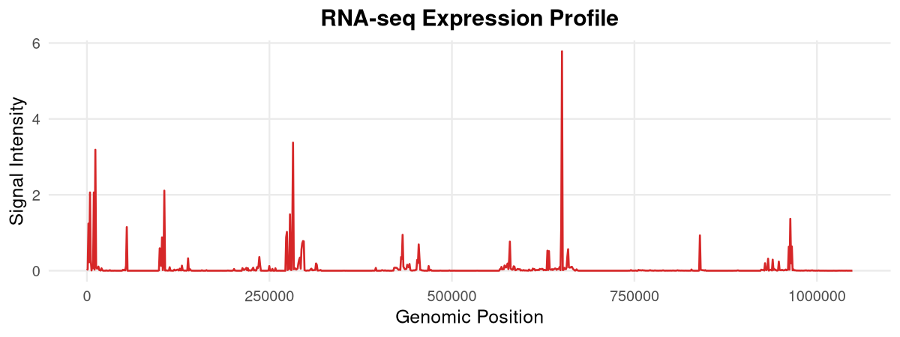
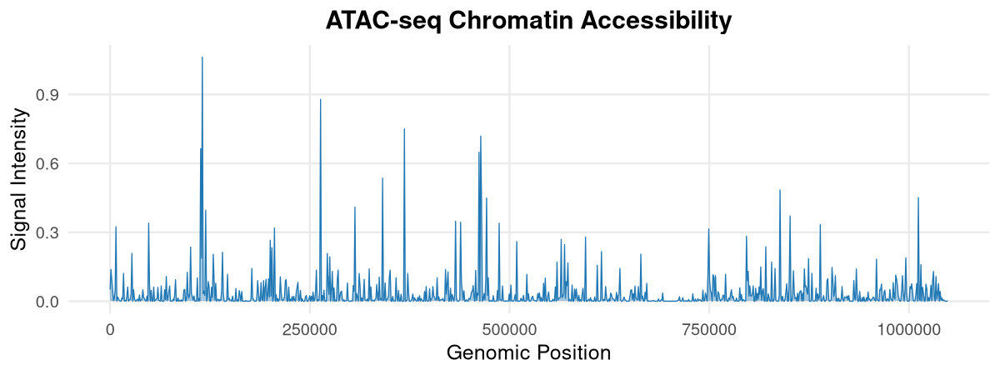
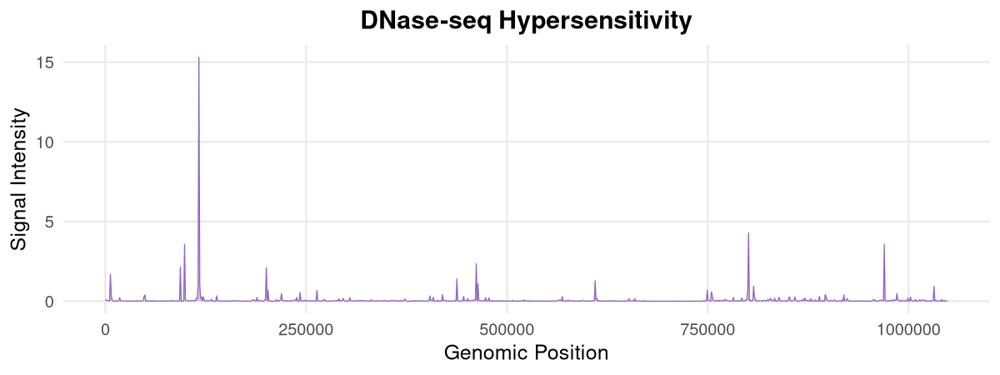
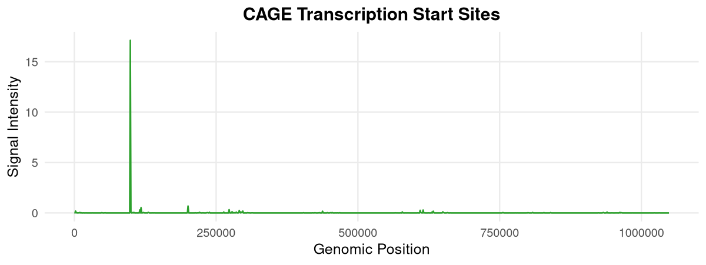
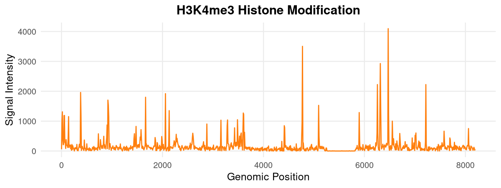
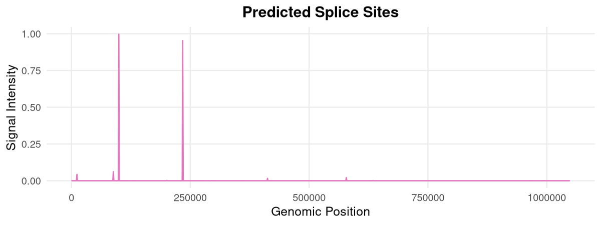

<p align="center">
  
</p>

<p align="center">
  <b>High-Resolution R Interface for Functional Genomic Predictions</b>
</p>

<p align="center">
  <a href="https://github.com/Bioconductor/Contributions/issues/4256">
    
  </a>
  <a href="https://opensource.org/licenses/Apache-2.0">
    
  </a>
  <a href="https://mintlify.wiki/BDB-Genomics/AlphaGenomeR">
    
  </a>
  <a href="https://github.com/BDB-Genomics/AlphaGenomeR/actions">
    
  </a>
</p>

## Overview

AlphaGenomeR provides a production-grade R interface to the AlphaGenome API. It enables researchers to retrieve multimodal functional genomic predictions at single-base resolution across 1MB genomic intervals. By bridging the official gRPC-based Python SDK, the package integrates deep learning predictions directly into Bioconductor-native workflows.

---

## Core Functions and Biological Modalities

AlphaGenomeR provides specialized extractors for each predicted biological signal. The following examples demonstrate the high-resolution data retrieved for a 1MB region on Chromosome 17.

### RNA-seq: Gene Expression Profiling
The `alphagenome_get_rna_seq()` function extracts predicted expression levels for polyA+ and total RNA tracks.



### ATAC-seq: Chromatin Accessibility
The `alphagenome_get_atac()` function retrieves predicted chromatin accessibility, identifying regions of open chromatin with base-pair precision.



### DNase-seq: Regulatory Element Mapping
The `alphagenome_get_dnase()` function extracts hypersensitivity signals, which are highly correlated with active enhancers and promoters.



### CAGE: Transcription Start Site Discovery
The `alphagenome_get_cage()` function identifies precise transcription start sites by predicting Cap Analysis Gene Expression signal.



### Histone Modifications: Epigenetic Landscape
The `alphagenome_get_chip_histone()` function retrieves signals for various histone marks (e.g., H3K4me3, H3K27ac) at 128bp binned resolution.



### Splicing Patterns: Splice Site Prediction
The `alphagenome_get_splice_sites()` function extracts predicted probabilities for 5' and 3' splice sites across the genomic window.



---

## Technical Specifications

*   **Resolution**: Single-base resolution for most tracks; 128bp bins for epigenetic marks.
*   **Architecture**: Optimized gRPC data streaming via `reticulate`.
*   **Context**: Native support for **UBERON** and **CL** tissue/cell-type ontologies.
*   **Compatibility**: Direct integration with `GenomicRanges`, `DESeq2`, and `ggplot2`.

---

## Installation

### Prerequisites
AlphaGenomeR requires Python (>= 3.10) and the official `alphagenome` Python package:
```bash
pip install alphagenome
```

### R Package
```r
if (!require("devtools")) install.packages("devtools")
devtools::install_github("BDB-Genomics/AlphaGenomeR")
```

---

## Quick Start

```r
library(AlphaGenomeR)

# 1. Query a 1MB genomic region for Lung tissue
results <- alphagenome_query(
  access_token = "YOUR_API_KEY",
  genomic_region = "chr17:42560601-43609177",
  ontology_terms = "UBERON:0002048"
)

# 2. Extract and visualize RNA-seq predictions
rna_data <- alphagenome_get_rna_seq(results)
head(rna_data$values)
```

---

## Citation & License

If you use AlphaGenomeR in your work, please cite:
> **Himanshu.** "AlphaGenomeR: An R/Bioconductor Interface for High-Resolution Genomic Predictions." (2026). https://github.com/BDB-Genomics/AlphaGenomeR

Licensed under **Apache License 2.0**. API usage is restricted to non-commercial research purposes.

---
**Developed by Himanshu**
