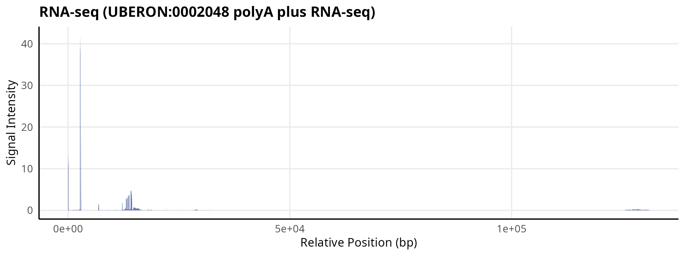
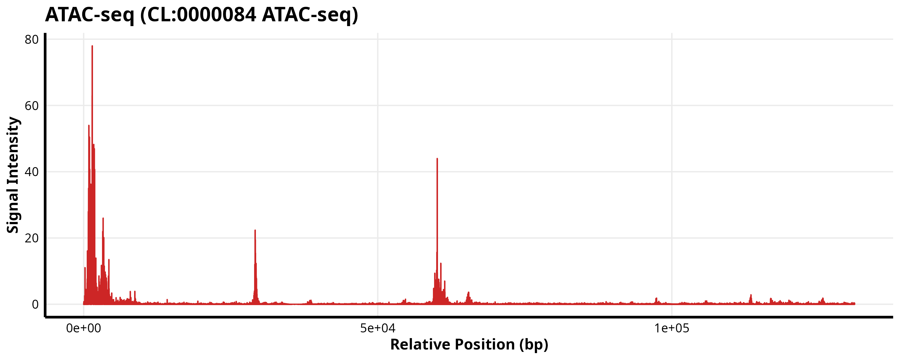

<!-- HERO -->
<p align="center">
  
</p>

<h1 align="center">AlphaGenomeR</h1>

<p align="center">
  <b>High-resolution functional genomic predictions from AlphaGenome, directly in R</b>
</p>

<p align="center">
  <a href="https://github.com/Bioconductor/Contributions/issues/4256">
    
  </a>
  <a href="https://opensource.org/licenses/Apache-2.0">
    
  </a>
  <a href="https://mintlify.wiki/BDB-Genomics/AlphaGenomeR">
    
  </a>
  <a href="https://doi.org/10.5281/zenodo.19772912">
    
  </a>
</p>

<p align="center">
  
</p>

<p align="center">
  <sub>Bridging the official AlphaGenome Python SDK into Bioconductor-friendly R workflows</sub>
</p>

## Overview

`AlphaGenomeR` provides an R interface to Google DeepMind's AlphaGenome API.
It uses `reticulate` to call the official Python client and returns R-friendly
objects for downstream analysis.

Typical uses:

- query a 1 Mb genomic interval
- retrieve RNA-seq, ATAC-seq, DNase-seq, CAGE, TF/histone, splicing, and contact predictions
- convert results into matrices and metadata tables in R
- integrate predictions into Bioconductor workflows

## Project Status

- Bioconductor submission: `0.99.0`
- Validated on real AlphaGenome API outputs
- Actively developed

## Installation

### 1. Create a dedicated Python environment

`AlphaGenomeR` depends on the Python package `alphagenome`. Use the included
Conda environment file to avoid dependency conflicts with your base environment.

```bash
conda env create -f dev/alphagenome.yaml
conda activate alphagenomer
```

### 2. Install the R package

For the development version from GitHub:

```r
if (!requireNamespace("BiocManager", quietly = TRUE)) {
    install.packages("BiocManager")
}

BiocManager::install("BDB-Genomics/AlphaGenomeR")
```

Once accepted into Bioconductor:

```r
if (!requireNamespace("BiocManager", quietly = TRUE)) {
    install.packages("BiocManager")
}

BiocManager::install("AlphaGenomeR")
```

### 3. Point `reticulate` to the environment

Set `RETICULATE_PYTHON` before loading the package.

```r
Sys.setenv(
    RETICULATE_PYTHON = "/path/to/miniconda3/envs/alphagenomer/bin/python"
)

library(AlphaGenomeR)
```

## Quick Start

```r
Sys.setenv(
    RETICULATE_PYTHON = "/path/to/miniconda3/envs/alphagenomer/bin/python"
)

library(AlphaGenomeR)

results <- alphagenome_query(
    access_token = "YOUR_API_KEY",
    genomic_region = "chr17:42560601-43609177",
    ontology_terms = "UBERON:0002048",
    requested_outputs = c("RNA_SEQ", "ATAC")
)

rna <- alphagenome_get_rna_seq(results)
atac <- alphagenome_get_atac(results)
```

## Requirements

- Python `>= 3.10`
- `alphagenome` Python package `>= 0.6.1`
- valid AlphaGenome API key
- internet access for live API queries

## Supported Outputs

- `alphagenome_get_rna_seq()`
- `alphagenome_get_atac()`
- `alphagenome_get_cage()`
- `alphagenome_get_dnase()`
- `alphagenome_get_chip_tf()`
- `alphagenome_get_chip_histone()`
- `alphagenome_get_splice_sites()`
- `alphagenome_get_splice_junctions()`
- `alphagenome_get_splice_usage()`
- `alphagenome_get_procap()`
- `alphagenome_get_contact_maps()`

## Typical Workflow

1. Create or activate the dedicated Python environment.
2. Set `RETICULATE_PYTHON`.
3. Query a genomic region with `alphagenome_query()`.
4. Extract modality-specific data with the helper functions.
5. Use the returned matrices and metadata in downstream R analyses.

## Example Outputs

<p align="center">
  
  
</p>

<p align="center"><i>Representative RNA-seq and ATAC-seq outputs from AlphaGenomeR.</i></p>

## Citation

If you use `AlphaGenomeR`, please cite:

- `AlphaGenomeR` (R package): <https://doi.org/10.5281/zenodo.19774275>
- AlphaGenome model publication

You can also run:

```r
citation("AlphaGenomeR")
```

---

**Developed by Himanshu Bhandary**
