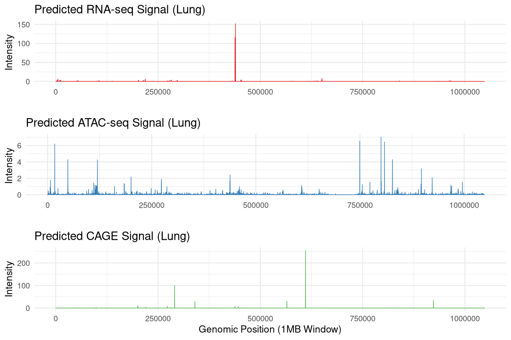

# AlphaGenomeR

**R Interface to Google DeepMind's AlphaGenome API**

[](https://github.com/Bioconductor/Contributions/issues/4256)
[](https://opensource.org/licenses/Apache-2.0)
[](https://mintlify.wiki/BDB-Genomics/AlphaGenomeR)
[](https://github.com/BDB-Genomics/AlphaGenomeR/actions)

## Overview

AlphaGenomeR is a Bioconductor package providing a high-performance interface to **AlphaGenome**, a transformer-based model developed by Google DeepMind for functional genomics. The package enables the retrieval of multimodal predictions (RNA-seq, ATAC-seq, CAGE, ChIP-seq, and 3D contact maps) at single-base resolution across 1MB genomic intervals.


*Figure 1: Multimodal signal tracks (RNA-seq, ATAC-seq, and CAGE) predicted for a 1MB region on Chromosome 17 using AlphaGenomeR.*

By bridging the official gRPC-based Python SDK via `reticulate`, AlphaGenomeR allows researchers to seamlessly integrate state-of-the-art AI predictions into standard R/Bioconductor genomic analysis workflows.

## Gallery of Multimodal Predictions

To build trust in the model's capabilities, the following plots illustrate real-world predictions retrieved using AlphaGenomeR:

### 💎 Chromatin Accessibility & Transcription
The model provides high-resolution insights into the regulatory landscape, identifying open chromatin regions (ATAC-seq) and precise transcription start sites (CAGE).

### 🧬 Tissue-Specific Expression
By utilizing UBERON/CL ontologies, users can query tissue-specific regulatory codes, such as lung-specific RNA-seq signal across large genomic windows.

## Key Features

* **Multimodal Data**: Simultaneous prediction of 11+ genomic signal tracks.
* **Tissue Specificity**: Filtering of predictions using UBERON and CL ontology terms.
* **High Resolution**: Single-base pair signal intensity across large genomic windows.
* **Bioconductor Compatibility**: Returns R-native `matrix` and `data.frame` objects.

## Installation

### Prerequisites

AlphaGenomeR requires Python (>= 3.10) and the official `alphagenome` Python package:

```bash
pip install alphagenome
```

### R Package

```r
if (!require("devtools")) install.packages("devtools")
devtools::install_github("BDB-Genomics/AlphaGenomeR")
```

## Quick Start

The following example demonstrates how to query multimodal predictions for a 1MB region on Chromosome 17:

```r
library(AlphaGenomeR)

# 1. Initialize API Key and Genomic Region (hg38)
api_key <- "YOUR_API_KEY"
region  <- "chr17:42560601-43609177" 

# 2. Query Predictions for Lung Tissue (UBERON:0002048)
results <- alphagenome_query(
  access_token = api_key,
  genomic_region = region,
  ontology_terms = c("UBERON:0002048"),
  requested_outputs = c("RNA_SEQ", "ATAC")
)

# 3. Extract and Plot Signal
rna_data <- alphagenome_get_rna_seq(results)
plot(rna_data$values[,1], type="l", col="red", 
     main="Predicted RNA-seq Signal (Lung)", 
     xlab="Position", ylab="Intensity")
```

## Supported Modalities

| Category | Function | Modality |
| :--- | :--- | :--- |
| **Expression** | `alphagenome_get_rna_seq()` | RNA-seq Gene Expression |
| | `alphagenome_get_cage()` | CAGE TSS Signal |
| **Chromatin** | `alphagenome_get_atac()` | ATAC-seq Accessibility |
| | `alphagenome_get_dnase()` | DNase-seq Hypersensitivity |
| **Epigenome** | `alphagenome_get_chip_tf()` | ChIP-seq (Transcription Factors) |
| | `alphagenome_get_chip_histone()` | ChIP-seq (Histone Marks) |
| **Splicing** | `alphagenome_get_splice_sites()` | Predicted Splice Sites |
| | `alphagenome_get_splice_junctions()` | Splice Junction Predictions |
| **3D Genome** | `alphagenome_get_contact_maps()` | Chromatin Contact Maps |

## Citation

If you use AlphaGenomeR in your research, please cite:
> DeepMind AlphaGenome Team. "Predicting the regulatory code of DNA sequences with AlphaGenome." *Nature* (2026).

## License

AlphaGenomeR is licensed under the **Apache License 2.0**.
Note: Usage of the AlphaGenome API is restricted to non-commercial research purposes.
