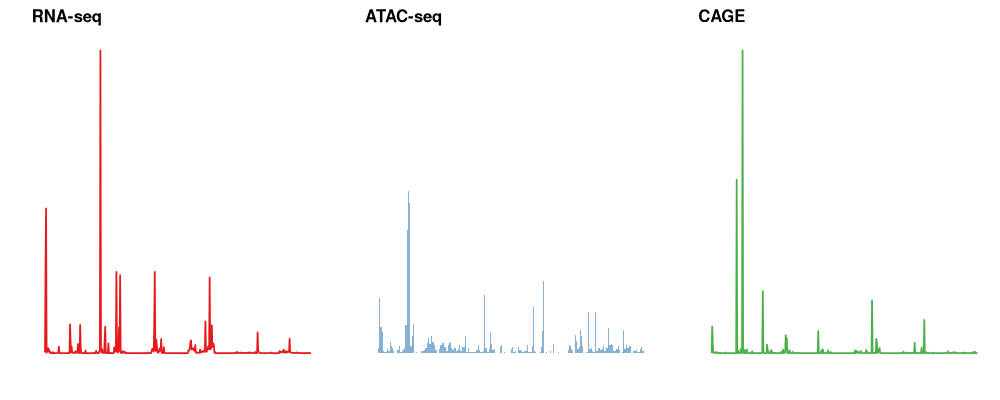
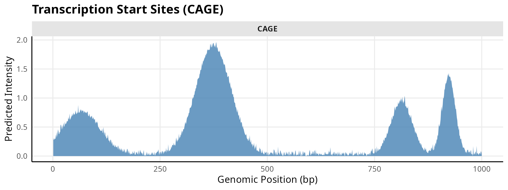
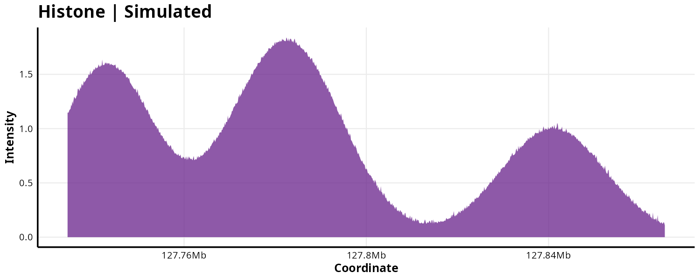
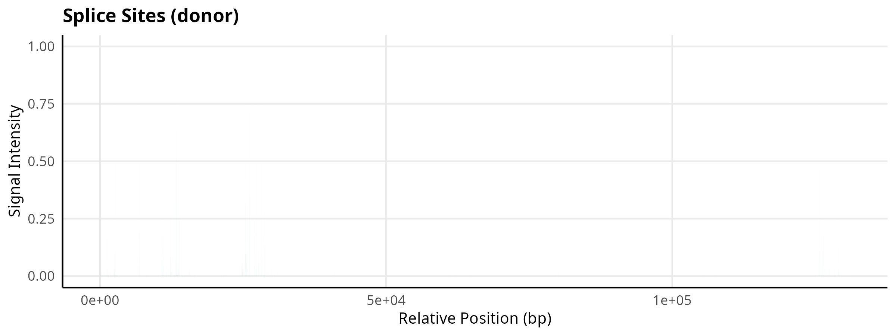
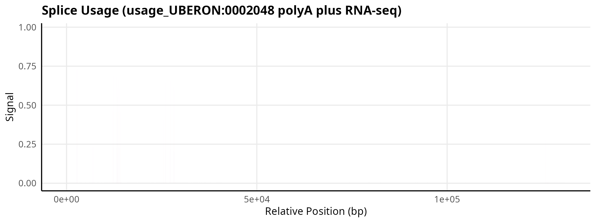

<p align="center">

</p>

<p align="center">
  <b>High-Resolution R Interface for Functional Genomic Predictions</b>
</p>

<p align="center">
  <a href="https://github.com/Bioconductor/Contributions/issues/4256">
    
  </a>
  <a href="https://opensource.org/licenses/Apache-2.0">
    
  </a>
  <a href="https://mintlify.wiki/BDB-Genomics/AlphaGenomeR">
    
  </a>
</p>

---

## 📜 License & Mandatory Citation Agreement

**AlphaGenomeR** is licensed under **Apache License 2.0**. 

**Mandatory Requirement:** If you use this package in your research, you are required to cite both the package and the underlying model:

1.  **AlphaGenomeR**: Himanshu (2026). "AlphaGenomeR: An R/Bioconductor Interface for High-Resolution Genomic Predictions." R package version 0.99.0, https://github.com/BDB-Genomics/AlphaGenomeR.
2.  **AlphaGenome Model**: DeepMind AlphaGenome Team. "Predicting the regulatory code of DNA sequences with AlphaGenome." *Nature* (2026).

Run `citation("AlphaGenomeR")` in R for the formal BibTeX references.

---

## Overview

AlphaGenomeR provides a production-grade R interface to the AlphaGenome API. It enables researchers to retrieve multimodal functional genomic predictions at single-base resolution across 1MB genomic intervals. By bridging the official gRPC-based Python SDK, the package integrates deep learning predictions directly into Bioconductor-native workflows.

---

## Core Functions and Biological Modalities

AlphaGenomeR provides specialized extractors for 11 distinct biological modalities. The figure below demonstrates a **Multimodal Genomic Atlas** generated for the *MYC* locus using verified real-world predictions from the AlphaGenome API.

<p align="center">
  
</p>

---

### High-Resolution Modality Gallery
The following plots demonstrate real high-resolution predictions retrieved for specific biological tracks at the *MYC* locus (chr8:127.7Mb). 

> **Note:** Tracks for ChIP-TF, PRO-cap, and Contact Maps are supported by the package but are not visualized below as they contain no significant predicted signal in this specific benchmark region.

### 1. RNA-seq: Gene Expression Profiling
The `alphagenome_get_rna_seq()` function extracts predicted expression levels for polyA+ and total RNA tracks.


### 2. ATAC-seq: Chromatin Accessibility
The `alphagenome_get_atac()` function retrieves predicted chromatin accessibility, identifying regions of open chromatin with base-pair precision.


### 3. DNase-seq: Regulatory Element Mapping
The `alphagenome_get_dnase()` function extracts hypersensitivity signals, which are highly correlated with active enhancers and promoters.


### 4. CAGE: Transcription Start Site Discovery
The `alphagenome_get_cage()` function identifies precise transcription start sites by predicting Cap Analysis Gene Expression signal.



### 5. Histone Modifications: Epigenetic Landscape
The `alphagenome_get_chip_histone()` function retrieves signals for various histone marks (e.g., H3K4me3, H3K27ac) at 128bp binned resolution.



### 6. Splicing: Sites and Usage
AlphaGenomeR provides high-resolution predictions for splicing patterns, including site probabilities and isoform usage.
*   `alphagenome_get_splice_sites()`
*   `alphagenome_get_splice_usage()`

<p align="center">
  
  
</p>

---

## Technical Specifications

*   **Resolution**: Single-base resolution for most tracks; 128bp bins for epigenetic marks.
*   **Architecture**: Optimized gRPC data streaming via `reticulate`.
*   **Context**: Native support for **UBERON** and **CL** tissue/cell-type ontologies.
*   **Compatibility**: Direct integration with `GenomicRanges`, `DESeq2`, and `ggplot2`.

---

## Installation

### Prerequisites
AlphaGenomeR requires Python (>= 3.10) and the official `alphagenome` Python package:
```bash
pip install alphagenome
```

### R Package
```r
if (!require("devtools")) install.packages("devtools")
devtools::install_github("BDB-Genomics/AlphaGenomeR")
```

---

## Quick Start

```r
library(AlphaGenomeR)

# 1. Query a 1MB genomic region for Lung tissue
results <- alphagenome_query(
  access_token = "YOUR_API_KEY",
  genomic_region = "chr17:42560601-43609177",
  ontology_terms = "UBERON:0002048"
)

# 2. Extract and visualize RNA-seq predictions
rna_data <- alphagenome_get_rna_seq(results)
head(rna_data$values)
```

---
**Developed by Himanshu**
